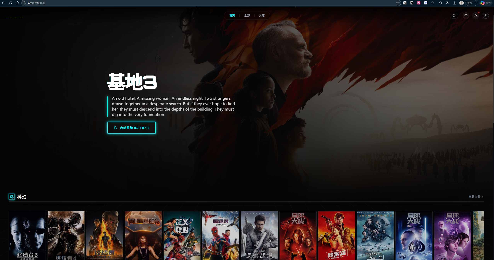
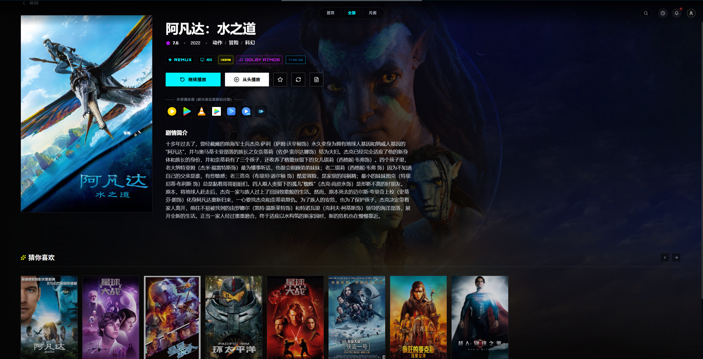
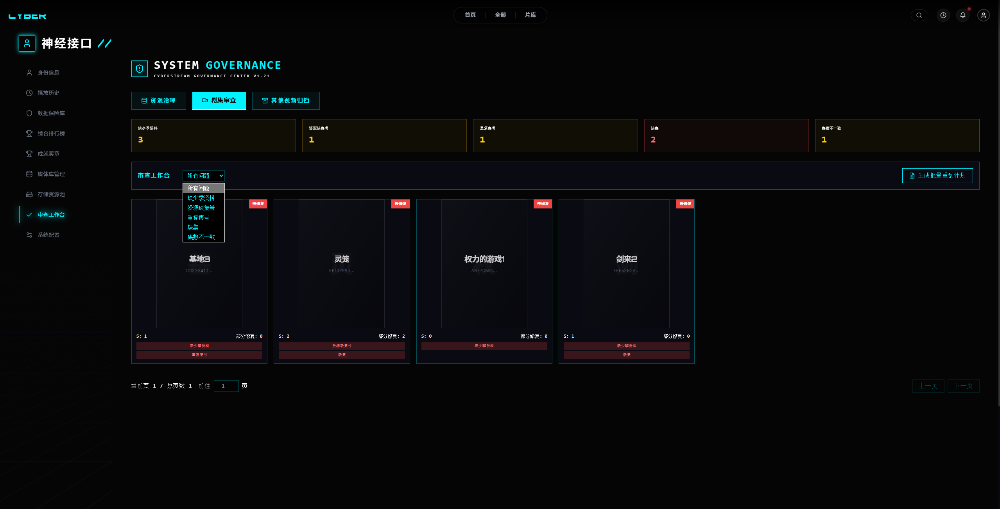
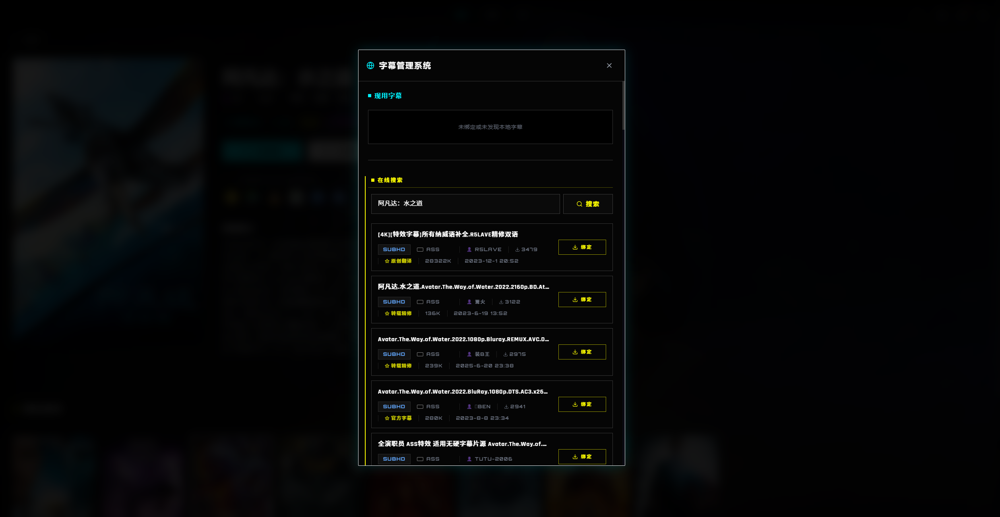

<div align="center">

# CyberStream · 赛博影视

**为发烧级自托管玩家打造的赛博朋克风影视中心**

存储无关 · 元数据可溯源 · 真技术规格 · 真本地播放器 handoff

[English](README.en.md) · [架构说明](docs/ARCHITECTURE.md) · [API 总览](docs/API_OVERVIEW.md) · [运行手册](docs/RUNBOOK.md) · [测试清单](docs/TEST_CHECKLIST.md)

</div>

---

## 这个项目是什么

CyberStream 是一套自托管的影视库系统：自己掌握的存储、自己掌握的刮削、自己掌握的播放链路。

它**不是又一个 Plex/Emby/Jellyfin 替代品**——它的目标不是把"易用"做到极致，而是把"上限"拉到极致。

- 你的资源库横跨 **本地 / WebDAV / SMB / FTP / AList / OpenList**？只要后端连得上，前端就能扫、能管、能播。
- 你纠结片源是 **UHD Blu-ray Remux + Dolby TrueHD 7.1 Atmos** 还是 1080p AAC 2.0？技术规格逐项落库、逐项展示，不再只是文件名上的一个标签。
- 你追求 **PotPlayer / IINA / VLC / nPlayer / Infuse / MX Player** 的本地播放器解码上限，不想被网页 H.265 解不出来吊打？外部播放器 handoff 已经是一等公民。
- 你在乎 **元数据来源**——TMDB / Bangumi / NFO / 本地 fallback 各拿什么字段、为什么这么拿、能不能锁定不被覆盖？审查工作台和字段锁定都给你。

如果你是"够用就行"的用户，这套系统对你来说会显得过于复杂。如果你是把片库当工程来经营的人，欢迎进入。

---

## 截图

<table>
  <tr>
    <td width="50%"></td>
    <td width="50%"></td>
  </tr>
  <tr>
    <td align="center"><sub>首页 · 主背景跟随选中影片，多分区横向 carousel 一屏到底</sub></td>
    <td align="center"><sub>影片详情 · REMUX / 4K / HDR10 / Dolby Atmos 真技术规格徽章 + 7 个外部播放器入口</sub></td>
  </tr>
  <tr>
    <td width="50%"></td>
    <td width="50%"></td>
  </tr>
  <tr>
    <td align="center"><sub>资源治理 · 缺集 / 重复集号 / 集数漂移一屏诊断</sub></td>
    <td align="center"><sub>字幕管理 · 现用字幕 + SubHD / 字幕库在线检索，候选优先级 srt &gt; 未知 &gt; sup</sub></td>
  </tr>
</table>

---

## 核心能力

### 存储与扫描

- 支持 `local` / `webdav` / `smb` / `ftp` / `alist` / `openlist` 六种协议接入
- 存储源能力矩阵 (`/api/v1/storage/capabilities`)：每种 provider 的扫描、预览、播放、Range、302 直链、健康检查能力可被前端动态查询
- 目录预览 / 已保存来源浏览：选根路径前能先看一眼真实目录结构，不用盲填
- 全库 / 单挂载源 / 单资源库三级扫描入口，共享统一扫描锁，杜绝并发冲突
- 资源治理：孤儿资源、空壳影片、重复副本、失效路径四类问题独立检测；live-check 后台任务可以批量探测父目录而不动数据库；执行清理前必出 dry-run，删除项保留 `restore_snapshot` 可逆向恢复

### 元数据刮削

- 多 provider 抽象：`nfo` / `tmdb` / `bangumi` / `local` 同台竞争，按 `provider_order` 编排
  - 动漫库可显式配置 `["nfo", "bangumi", "tmdb", "local"]`，让番剧识别走 Bangumi 而非 TMDB
  - 候选返回 `match_explanation` 与 `rank`，告诉你为什么命中、为什么排第一
- 三层刮削管线：`strict`（规范命名直刮）→ `fallback`（经验兜底）→ `ai`（预留接入位）
- 字段级锁定：手动 PATCH 改过的字段默认锁定，下次扫描不会被覆盖；可显式 `metadata_unlocked_fields` 解锁后再刷新
- **两步式手动匹配**：`POST /v1/movies/{id}/metadata/match` 默认 dry-run 返回 diff，用户在 UI 看完再加 `apply: true` 真正写库；缺海报场景返回 409 强制二次确认
- 元数据审查工作台：失败分类、候选解释、批量重识别反馈、剧集诊断（缺集 / 重复集号 / 集数与季元数据不一致）一次给齐
- 单片上下文推荐：详情页底部按同系列、同标题族、同类型、同分区四级兜底；动漫与非动漫强制隔离

### 播放体验

- **不强制网页播放**：网页 HTML5 player 是入口之一，不是唯一选择
- **外部播放器 handoff** 一等公民：
  - 资源对象内联 `playback.web_player.url` / `playback.external_player.url` / `playback.stream_url`，单次请求拿全
  - `GET /v1/resources/{id}/external-playback` 返回完整 manifest（绝对 stream URL、默认字幕、player_profiles），`?format=m3u` 直接下 M3U 给 VLC / mpv 之类用
  - 详情页一键拉起 PotPlayer / IINA / VLC / nPlayer / MX Player / MX Player Pro / Infuse
- **真实音轨与音频转码**：网页端通过 `audioRef + videoRef` 双标签同步播放转码后的音轨；后端音频转码进程含上游 Range 缓存、首包诊断、单 session 替换、history watchdog 兜底
- **多源切换不卸载**：1080p ↔ 4K REMUX 切换时 React 树不重建，进度无缝续上
- **历史心跳**：每 10s 上报一次 `progress / duration`，断线续看跨设备同步
- **同目录字幕自动发现**：扫到 `srt/ass/ssa/vtt` 同名同前缀字幕自动挂上播放矩阵；网页端 `srt/ass/ssa` 后端动态转 WebVTT；外部播放器拿原始格式
- **在线字幕**：接入 `subhd` / `srtku`，候选按 `srt > 未知 > sup` 优先级排序，避免位图字幕被网页端误选；用户必须 `confirm: true` 才会绑定写库

### 资源库与发布控制

- 双层模型：`StorageSource`（物理来源）/ `Library`（逻辑资源库）/ `LibrarySource`（挂载点绑定）
- 资源库内容规则：`(挂载路径自动命中) ∪ 手动 include - 手动 exclude`，黑白名单都给
- **总影视库显式发布控制**：每部影片的 `catalog_visibility_status` 是 `auto` / `published` / `hidden`，把"是否对外可见"和"刮削来源"解耦——自录视频、课程、爬虫资源不会污染主库
- **其他视频归档**：`/api/v1/other-videos` 队列收集所有不适合自动刮削的资源；可通过 `recommended_resolution` 指引前端走"匹配元数据"还是"手工建影片壳"

### 安全与权限

- 单 token API 鉴权（`CYBER_API_TOKEN`）：管理类接口必须 Bearer / `X-Cyber-API-Token`；播放、图片、健康检查保持公开
- **可选用户管理**（默认关闭）：admin / user 两级角色，Cookie 会话登录，最后一个管理员保护，密码/角色/启用状态变更后 session 版本失效，登录失败限流，全程审计日志
- 资源库可见性 allow/deny：开启用户管理后所有列表、详情、播放、推荐、字幕、历史接口全部走可见性校验
- 个人字幕样式 / 个人观看历史：每用户独立隔离

### CDN 与图片资产

- 图片缓存可选挂 Super CDN：`cyberstream-cn-assets` 桶 + `china_all` 线路，国内访问海报/背景秒开
- 图片来源追踪：每张海报背后是 TMDB / Bangumi / NFO / manual / external 哪个来源、URL 是否被锁、缓存什么时候写的，全部 `source_info` 透出
- 批量预热 / 单片清理 / CDN purge：`POST /v1/images/refresh` 一次编排
- 视频流主链路**不走 CDN**：保持后端 302 直链或 byte-range 透传，避免 CDN 中转拖累 4K REMUX 播放

### 后台任务

- 持久化任务注册表 `maintenance_jobs`，进程重启后历史任务仍可查
- 主要异步入口：批量重刮削 / 资源治理清理 / 治理 live-check / 治理恢复
- 任务返回 `progress.{current, total, message}` 与可解释的 `result.items`，前端能做真实进度条而不是转圈圈
- **扫描进度独立**：扫描走 `GET /api/v1/scan` 轮询，不混进 jobs

---

## 仓库结构

```
CyberStream/
├── backend/         # Flask 后端：app/ + config.py + run.py
├── frontend/        # React 19 + Vite 6 + TypeScript SPA
├── docs/            # 架构、API、运维、测试、版本管理文档
├── scripts/         # backend_service.sh、db_backup.py 等运维脚本
├── tests/           # 后端集成测试
├── AGENTS.md        # 仓库协作指南
└── requirements.txt
```

前端工作目录在 `frontend/`，独立 `package.json`，可以单独 `npm run dev`。后端契约通过 `frontend/openapi.json` 与 `frontend/openapi-1.21.0-beta/` 同步。

---

## 快速启动

### 后端

```bash
# 进入仓库根
cp .env.local.example .env.local
# 编辑 .env.local 填入：
#   TMDB_TOKEN
#   CYBER_API_TOKEN
#   CYBER_BACKEND_PUBLIC_BASE_URL（反代场景）
#   （可选）CYBER_USER_MANAGEMENT_ENABLED + CYBER_SESSION_SECRET + 初始管理员

./scripts/backend_service.sh start          # 推荐：gunicorn 优先，缺失回退 Flask 内置
./scripts/backend_service.sh status
./scripts/backend_service.sh restart
./scripts/backend_service.sh stop

# 开发态前台启动
.venv/bin/python -m backend.run

# 健康检查
curl http://127.0.0.1:5004/
```

### 前端

```bash
cd frontend
npm install
npm run dev          # Vite dev server，端口 3000
npm run build        # tsc + Vite production build → dist/
npm run lint         # 仅类型检查（无 ESLint）
```

前端 `API_BASE` 在 `frontend/src/constants/index.ts`，默认指向公网后端入口。本地联调请改成 `http://127.0.0.1:5004/api`。

---

## 技术栈

| 层 | 技术 |
|---|---|
| 后端框架 | Python 3.10 + Flask + Flask-SQLAlchemy + SQLite |
| 后端服务 | gunicorn（生产）/ Flask（开发） |
| 元数据 | TMDB / Bangumi / NFO / 本地 fallback |
| 字幕 | 同目录发现 / SubHD / 字幕库（srtku）/ 后端动态 SRT→WebVTT |
| 前端框架 | React 19 + TypeScript + Vite 6 |
| 前端样式 | Tailwind CSS（utility 优先）+ 主题 CSS 变量 |
| 前端动效 | Motion (Framer Motion) |
| 前端图标 | Lucide React |
| 后台任务 | 自研轻量 job 注册表 + SQLite 持久化 |
| 静态资源 | 后端图片缓存 + 可选 Super CDN |

---

## 文档索引

| 主题 | 路径 |
|---|---|
| 项目移交 | [docs/PROJECT_HANDOVER.md](docs/PROJECT_HANDOVER.md) |
| 项目进度 | [docs/PROJECT_PROGRESS.md](docs/PROJECT_PROGRESS.md) |
| **PC 客户端目标 (v1)** | [docs/PC_CLIENT_GOAL.md](docs/PC_CLIENT_GOAL.md) |
| 架构说明 | [docs/ARCHITECTURE.md](docs/ARCHITECTURE.md) |
| API 概览 | [docs/API_OVERVIEW.md](docs/API_OVERVIEW.md) |
| 元数据管线 | [docs/METADATA_PIPELINE_V1.md](docs/METADATA_PIPELINE_V1.md) |
| 资源库设计 | [docs/LIBRARY_DESIGN_V1.md](docs/LIBRARY_DESIGN_V1.md) |
| 存储源配置流 | [docs/STORAGE_CONFIG_FLOW.md](docs/STORAGE_CONFIG_FLOW.md) |
| 音频转码设计 | [docs/AUDIO_TRANSCODE_DESIGN_NOTES.md](docs/AUDIO_TRANSCODE_DESIGN_NOTES.md) |
| 前端音频转码接入 | [docs/FRONTEND_AUDIO_TRANSCODE_GUIDE.md](docs/FRONTEND_AUDIO_TRANSCODE_GUIDE.md) |
| 审查工作台前端接入 | [docs/FRONTEND_REVIEW_WORKBENCH_INTEGRATION.md](docs/FRONTEND_REVIEW_WORKBENCH_INTEGRATION.md) |
| 用户管理前端接入 | [docs/FRONTEND_USER_MANAGEMENT_INTEGRATION.md](docs/FRONTEND_USER_MANAGEMENT_INTEGRATION.md) |
| 配置项参考 | [docs/CONFIG_REFERENCE.md](docs/CONFIG_REFERENCE.md) |
| 运行手册 | [docs/RUNBOOK.md](docs/RUNBOOK.md) |
| 测试清单 | [docs/TEST_CHECKLIST.md](docs/TEST_CHECKLIST.md) |
| 版本管理 | [docs/VERSIONING.md](docs/VERSIONING.md) |
| 维护待办 | [docs/MAINTENANCE_TODO.md](docs/MAINTENANCE_TODO.md) |

OpenAPI 当前基线：`backend/openapi/openapi-1.21.0-beta/openapi-1.21.0-beta.json`

---

## 当前版本

`1.21.0` —— 单主干维护，`main` 即最新版。

---

## 使用须知

**任何使用、二次开发、再分发本项目的行为，必须显式注明原作者及项目地址。**

具体要求：
- 注明作者：`Purewo`
- 注明项目：`https://github.com/Purewo/CyberStream`
- 在产品 UI、关于页、文档或源代码声明中至少一处可见
- 禁止删除原代码中的版权与署名信息

---

## 反馈

Issue：[https://github.com/Purewo/CyberStream/issues](https://github.com/Purewo/CyberStream/issues)
